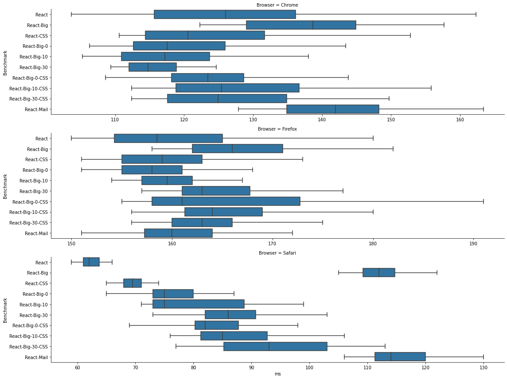
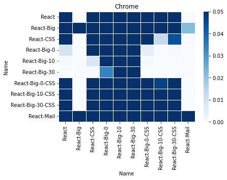
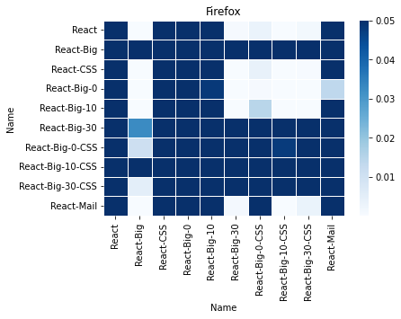
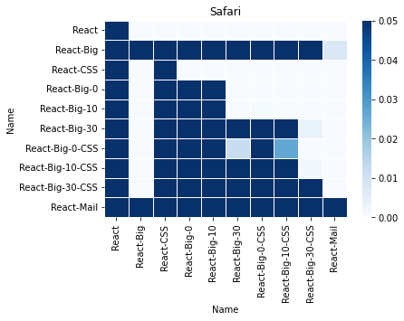
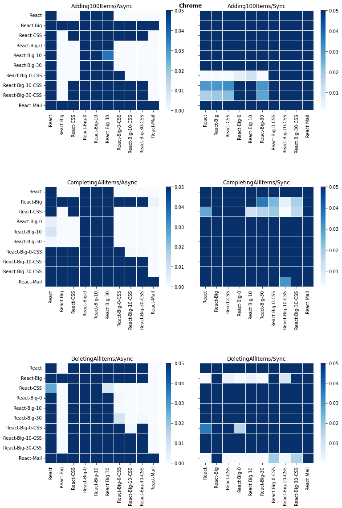
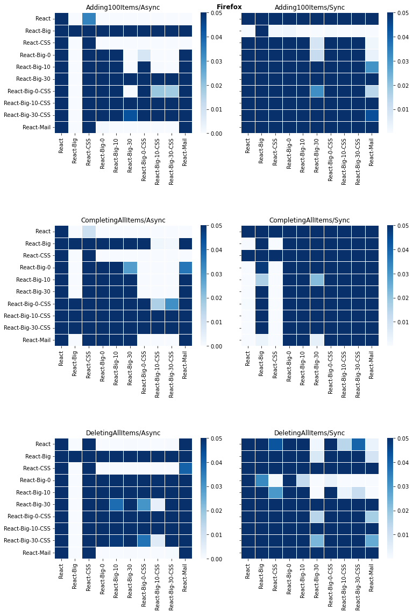
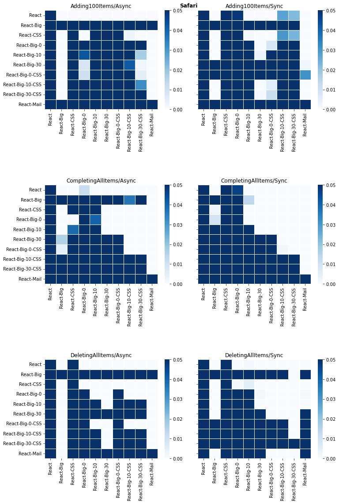

# Impact of embedding React-TodoMVC in a complex static HTML page.

## Summary

This is an impact analysis of the effect of embedding React-TodoMVC in a complex static HTML page. The comparisons in this page are between the following three workloads:

* **TodoMVC-React**: The original TodoMVC-React benchmark.
* **TodoMVC-React-Big**: The TodoMVC-React benchmark embedded in a big static HTML page.
* **TodoMVC-React-Mail**: An earlier iteration of *TodoMVC-React-Big* built with different tooling, and which the group agreed was a good starting point for the workload.

## Results and Conclusion

Each benchmark was ran 50 times on each browser. The following boxplots show the distribution of the results. The x-axis is miliseconds, the y-axis is the benchmark ran.

There seems to be little to no difference between the *TodoMVC-React-Mail* and *TodoMVC-React-Big*. This is further confirmed by the statistically significat heatmaps below.

> How to interpret the heatmaps: The heatmap shows the p-value of the mannWhitney test between the two benchmarks. A lighter color represents there is statistically signigicant evidence that the benchmark in {row} is faster than the benchmark in {column}.

### Chrome

### Firefox

### Safari

The benchmarks impact the different test steps differently for each browser, as we can see in the per-step heatmaps below.

### Chrome

### Firefox

### Safari

