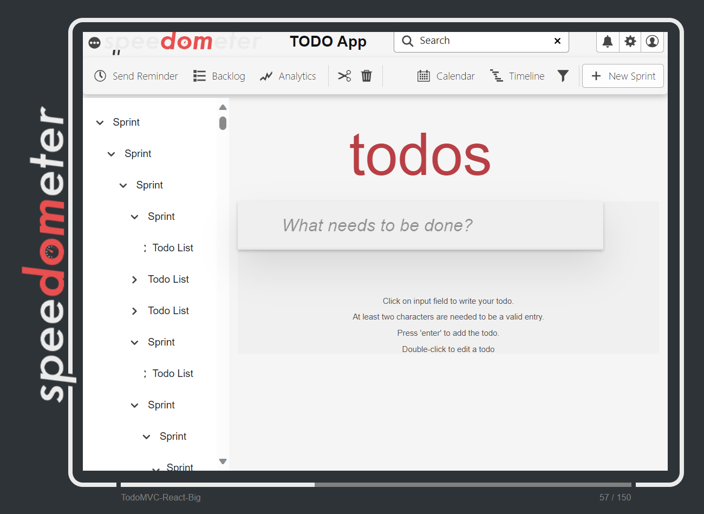

# TodoMVC embedded in a complex big static DOM

## The benchmark

This workload embeds the todoMVC benchmark in an html page with the following characteristics.

-   The page is a big static DOM with around 4000 elements.
-   The page is styled using the @spectrum-css adobe library, which relies on css variables for uniform styling.
-   The @spectrum-css rules of the page are post processed using postcss and purgecss.
-   The page includes other 400 complex color css rules using different kinds of css selectors and combinators.
-   200 of the above rules will fully match elements added by the todoMVC benchmark, but not elements in the UI. E.g. `.toggle-all-container ~ ul > .li-6 > .view-6.targeted`.
-   200 of the above rules will partially match elements added by the todoMVC benchmark (the right most selector will match). E.g. `.header.just-span .header ~ .main .view-31`.
-   We added new classes `li-{index}` and `view-{index}` to the todoMVC benchmark list items to make it easier to match the elements. We also added a class `targeted` to them to avoid affecting other elements with the generated CSS.

<p align = "center">

</p>

## Structure of the folder

-   _src_ Code to generate the big static DOM
-   _dist_ - Output folder for the big static DOM generator.
-   _angular_ - Output folder for the angular generated.css.

## How to run

`npm run build` - Generates the static html and corresponding css.

`npm run serve` - Serves the dist folder in port 7002.

## The generator

The generator is a nodejs script that uses `renderToStaticMarkup` to generate the static html.

### Dom Generator

-   Uses a random seedable library with a default seed for all its random operations.
-   Takes `MAX_DEPTH`, `TARGET_SIZE` and to randomly generate the big folder-like structure embedded in the sidebar.
-   To generate the sidebar, each node decides if it will have children based on the `CHILD_PROB` value. Then randomly chooses a number of children between 1 and `MAX_BREADTH`.

### CSS Generator

Matching rules:

-   Starts at the list element or view element of a todoMVC item.
-   The right-most selector will include the `:not(.ui)` selector to avoid matching elements in the UI.
-   Randomly decides the length of the selector between 1 and `MAX_SELECTOR_LENGTH`.
-   Randomly picks the selector for the current step, either a class selector, a type selector or a universal selector (maybe add attributes?).
-   Randomly picks the combinator for the current step, either a child combinator, a descendant combinator, a general sibling combinator or an adjacent sibling combinator. It will only pick valid combinators for the current step, i.e. not a sibling combinator if the current node has no sibling.
-   Stops when the target length was reached.

Non Matching rules:

-   Starts at the list element or view element of a todoMVC item.
-   Randomly decides the length of the selector between 1 and `MAX_SELECTOR_LENGTH`.
-   Randomly picks the selector for the current step, either a class selector, a type selector or a universal selector (maybe add attributes?).
-   Randomly picks the combinator for the current step, either a child combinator, a descendant combinato, a general sibling combinator or an adjacent sibling combinator. It will only pick valid combinators for the current step, i.e. not a sibling combinator if the current node has no sibling.
-   When the target length was reached, it will add `.just-span` to the left-most selector to force it to not match any element. The `.just-span` is a class name tag that some span elements in the UI have.

## The CSS

## Install

In the root directory of this package, run:

```bash
$ npm link
```

This will create a symlink to the package in the global `node_modules` directory.

In the project where we want to use the big-dom-generator package, run:

```bash
$ npm link big-dom-generator --save
```

This will create a symlink to the package in the local `node_modules` directory of the project. The flag `--save` will create an entry in the package.json if one doesn't already exist. Now you can use the package in the project as if it was installed from npm.

## Usage

To use the big-dom-generator package in a javascript project, you can import the CSS file like this:

```javascript
import "big-dom-generator/generated.css";
```

This will import the generated.css file from the big-dom-generator package and apply the styles to your web page.

Alternatively, you can include the CSS file in your HTML file using a link tag:

```html
<link rel="stylesheet" href="node_modules/big-dom-generator/generated.css" />
```

To use the angular version of the big-dom-generator package in an Angular project:

Import the CSS file in your Angular component:

```javascript
import "big-dom-generator/angular/generated.css";
```

Alternatively, you can include the CSS file in your angular.json file:

```json
{
    "projects": {
        "my-app": {
            "architect": {
                "build": {
                    "options": {
                        "styles": ["node_modules/big-dom-generator/angular/generated.css"]
                    }
                }
            }
        }
    }
}
```
