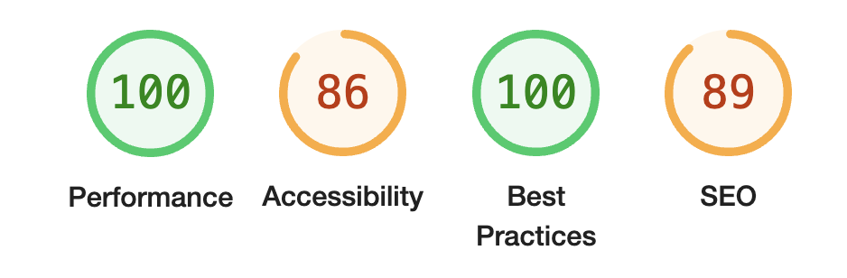
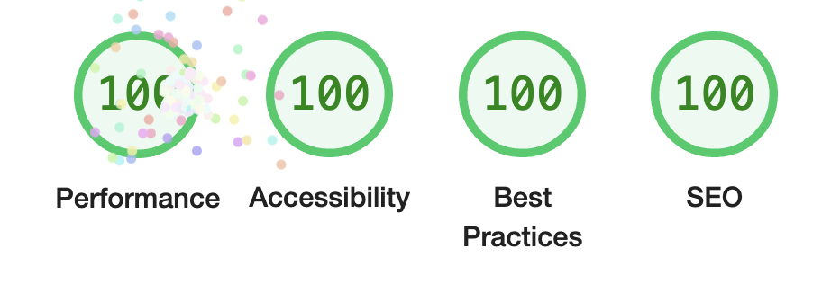
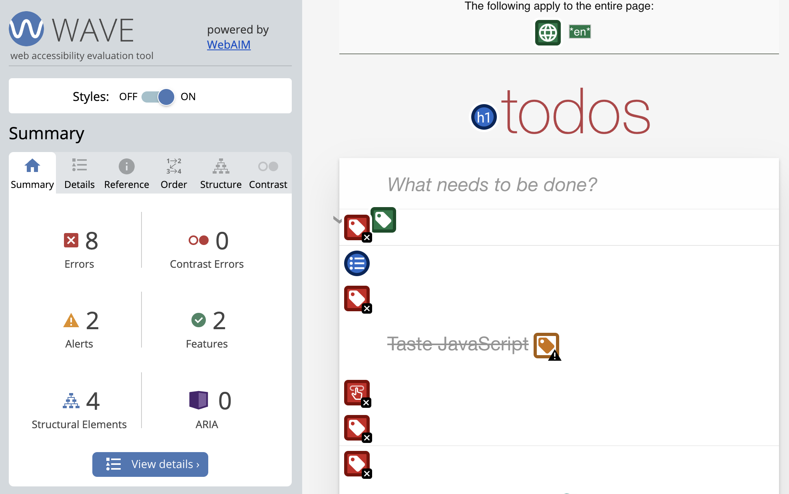
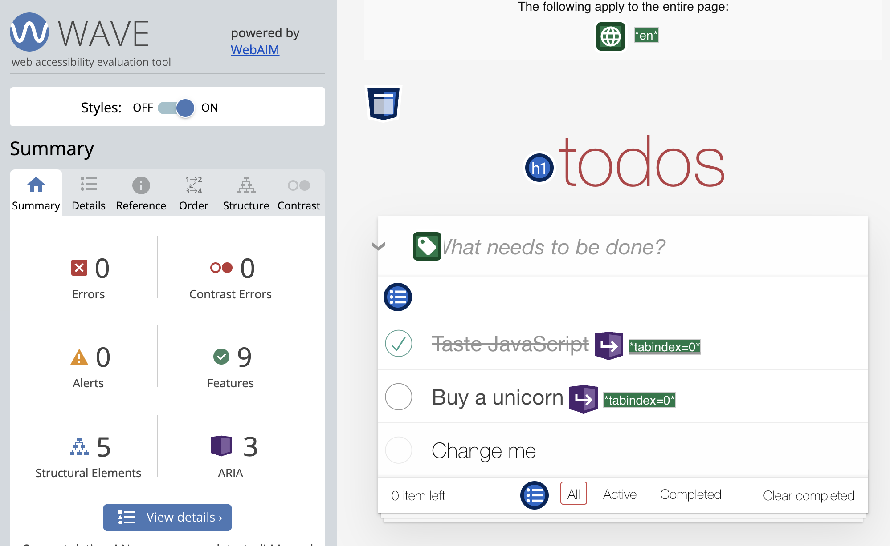
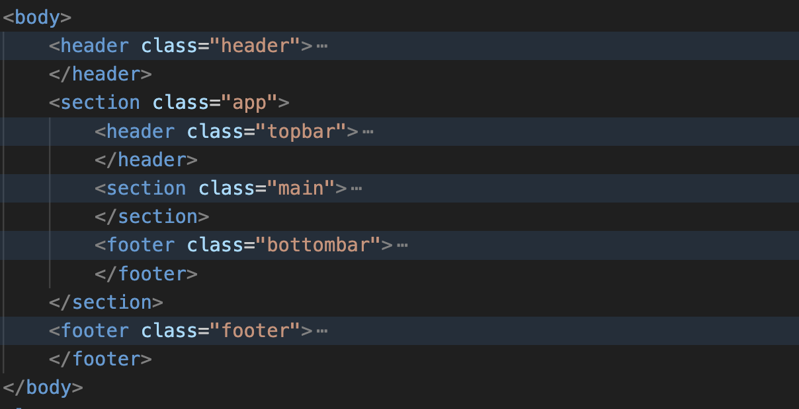
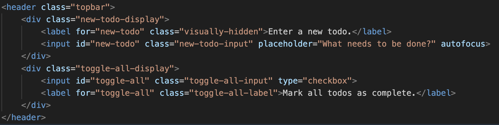
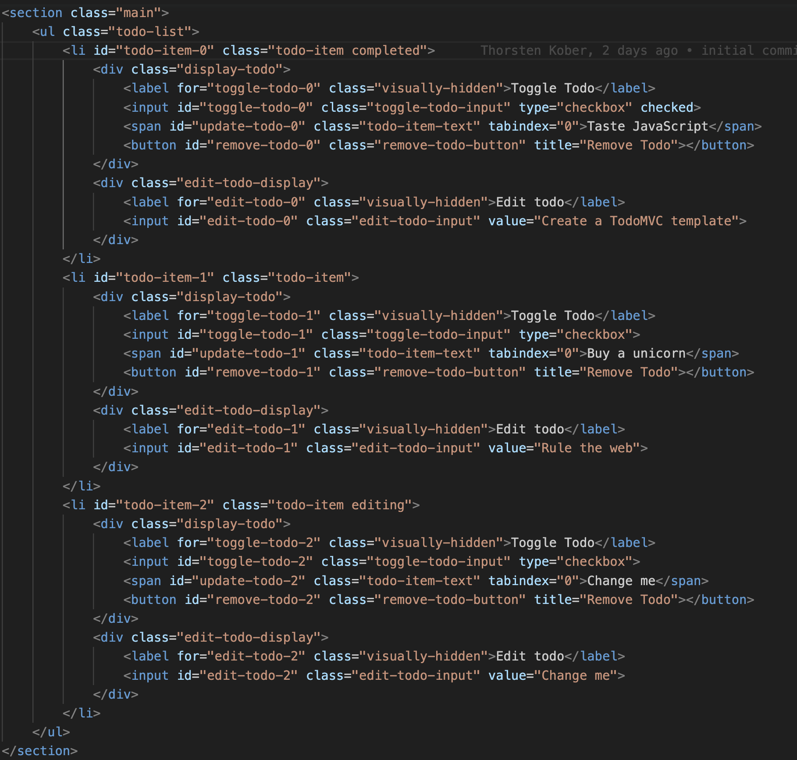
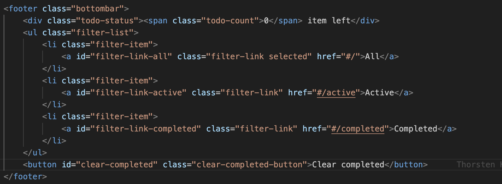

# Changes

## Screenshots

Lighthouse audit, before changes(reference files):

---

---

Lighthouse audit, after changes (updated files):

---

---

Wave audit, before changes(reference files):

---

---

Wave audit, after changes (updated files):

---

## Issues

### **Form elements do not have associated labels.**

There are several input elements that have a label missing (new todo input and edit todo input).
These labels have been added and wrapped in a container div.
This correctly informs screen readers of the intent of the input and the additional wrapping allows us to style / toggle visibility, ect.

### **Labels are incorrectly used / orphaned form label.**

The todo item toggle has now it's own label, that is just concerned with the complete / active states of the todo
The label content should appropriatly display the action `"Toggle Todo"`, instead of displaying the title of the todo.

The previous label that displayed the todo title was removed and replaced with a span element.
This change ensured that there are no more orphaned form labels present.

### **Button has no content.**

The button to remove a single todo doesn't have content, because it adds visual content (`"x"`) with css styles.
To allow useful hints, a title tag has been added to describe the purpose of the bottom.

## Other changes

The structure of the html file should follow the visual representation and some changes have been made accordingly.

Html structure, before changes(reference files):

Html structure, after changes (updated files):

### **Title**

The title was visually placed above the structural elements (pushed up with negative margins).
This has been changed and a header element is now placed as the first element of the page, allowing the flow of the document to show the title correctly as its child element.

### **_Info footer_**

The info footer class name has been changed to adhere to a consistent naming convention

### **_Toggle all checkbox_**

Similar to the title, this checkbox was placed in the main list container and pushed up visually to be placed in the previous header. This is now present in the app's "topbar", which contains the toggle all checkbox along with the new todo input field.

### **_Remove todo button_**

The class name changed to more clearly communicate what the button is doing.

### **_Element ids_**

All elements that a user can interact with have now an id, to be able to target the element more directly.
Input elements already needed an id present, and this addition results in consistency and also sets up the file structure to be more extensible.

### **_Focusable elements_**

All focusable elements are now clearly displayed with a red border and keyboard tab actions correctly "move" through the application structure.

### **_Todo Items_**

All todo items should receive a unique id, to be able to associate each label with its corresponding input correctly.
The index.html file in the root of the repo showcases how it should be implemented.

## Detailed screenshots

### **_Topbar_**

### **_Main_**

### **_Bottombar_**

